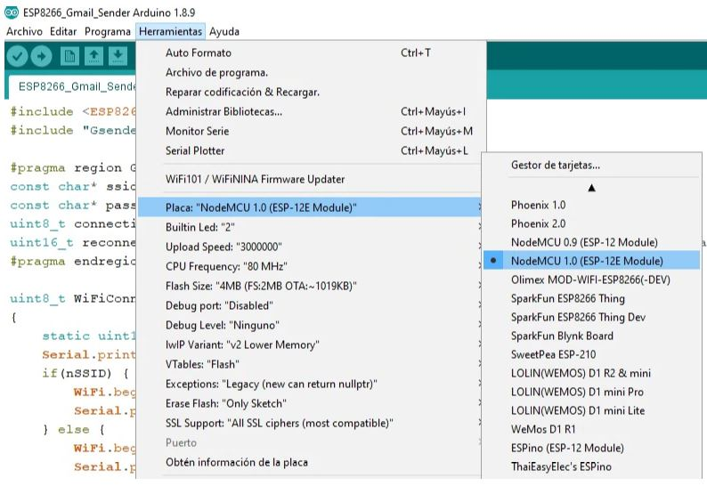
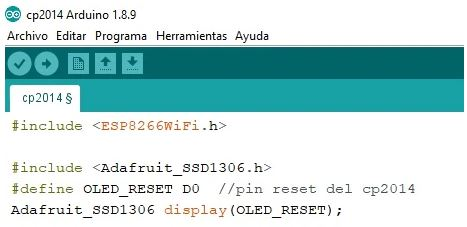

# CP2014 ESP8266 0.91 inch OLED 32Mb Flash WIFI Module for Arduino NodeMcu.
It connects to the Arduino IDE using the same card as the ESP8266 Node Mcu. 
You can use the "Adafruit_SSD1306.h" library to program its OLED. 
You must define the RESET pin as D0. 
In any case, after unpacking and connecting it, bring a program to TEST the wifi.
Add Board link: https://dl.espressif.com/dl/package_esp32_index.json, http://arduino.esp8266.com/stable/package_esp8266com_index.json
 

